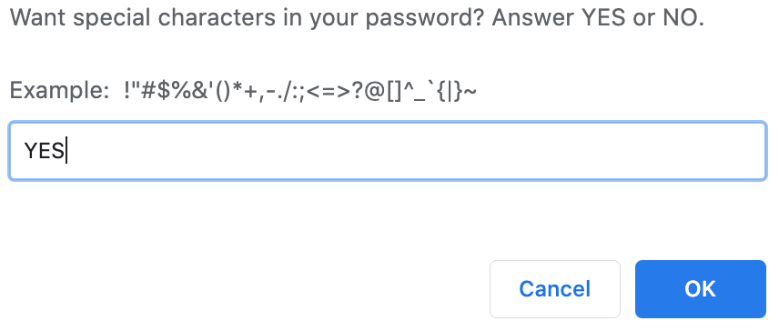
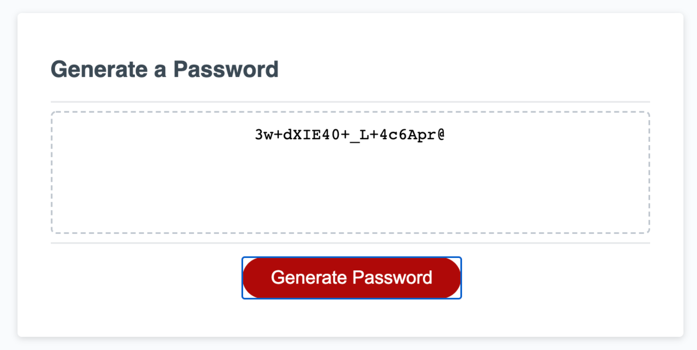

# Password Generator Wizard
By Weng Fei Fung. Generate a unique password that is hard to crack. This tool walks you through different password criteria so you can choose how strong your password will be.

### Password Criteria
- Lowercase characters
- Uppercase characters
- Numerical characters
- Special characters #$%&'()*+,-./:;<=>?@[\]^_`{|}~
- How long the password

### Recommended Criteria
The recommendation is to select Yes to all character criteria and pick a long password for the strongest unique password the app can generate.

## Live
Visit the [demo](https://Siphon880gh.github.io/password-generator-wizard)

## Screenshots
**1. Ask user**
<!--  -->

**2. Generates password**
<!--  -->
